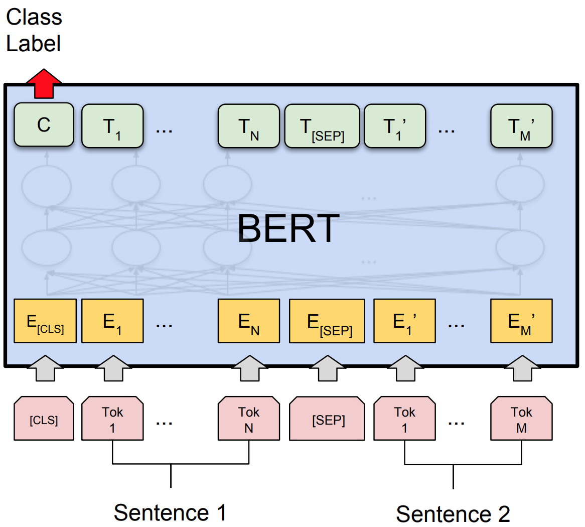

[BERT](https://arxiv.org/abs/1810.04805)模型正在自然语言处理领域大杀特杀！例如，BERT模型在包含9种任务的[GLUE基准测试](https://gluebenchmark.com/leaderboard)上将得分从72.7提高到了80.5——这是最新的重大突破[6]。

虽然BERT模型很好很强大，GluonNLP小分队却没有找到任何开源代码能够同时：
- 提供可扩展的GPU预训练
- 复现各种任务上的结果
- 支持模型输出和部署

为了解决以上所有的痛点，GluonNLP 0.6版本站了起来！

{:width="500px"}

## 用8块GPU预训练BERT，拢共要几天？

BERT是Bidirectional Encoder Representations from Transformers的简称。它 1) 使用了堆叠的双向Transformer编码器, 2) 在大型语料库上通过带自监督机制的Masked Language Model及下一句预测进行学习, 3) 仅需用一小撮标注过的数据进行微调即可将学习完毕的文本表示转移给特定的下游自然语言处理任务。

{:width="500px"}

一个精明的读者或许会问：既然BERT模型的[官方代码库](https://github.com/google-research/bert/)已经放出了多个用大量TPU训练好的预训练模型，我们为何还要自己出资预训练一个自己的BERT呢？那当然是因为预训练选择的语料库非常重要！如同其他的迁移学习场景一样，如果预训练的数据源和你手头任务的数据相近，最后的性能当然会更好。举个栗子，受不同的语言风格影响，用维基百科的语料库预训练的模型在微博上的帮助非常有限。

明知山有虎，偏向虎山行，我们从头开始对BERT基本版模型进行了预训练。训练中使用了包含20亿词（除去图片和表格）的英文维基百科以及去重后包含5亿7950万词汇的书籍语料库。在利用混合精度训练以及梯度累加的条件下，8块Volta V100 GPU使用了6.5天将BERT基本版模型训练好，并在验证集上得到了如下结果：

| Dataset                                 | GluonNLP     |  BERT Paper  |
|-----------------------------------------|--------------|--------------|
| Microsoft Research Paraphrase Corpus    | **88.0**     |  86.4        |
| The Stanford Sentiment Treebank         | **93.0**     |  92.7        |
| Multi-genre Natural Language Inference  | 82.8         |  **84.4**    |
| Stanford Question Answering Dataset 1.1 | **81.0 88.6**|  80.8 88.5   |

## 复现BERT自然语言理解任务的微调结果，有脚本有日志有真相

GluonNLP的目标是？消灭无法复现的研究结果！我们提供了可复现[RTE](https://arxiv.org/abs/1804.07461)[6]、[MNLI](http://aclweb.org/anthology/N18-1101)[8]、SST-2、[MRPC](https://www.microsoft.com/en-us/download/details.aspx?id=52398)[10]、[SQuAD 1.1](https://rajpurkar.github.io/SQuAD-explorer/explore/1.1/dev/)[9]和[SQuAD 2.0](https://rajpurkar.github.io/SQuAD-explorer/explore/v2.0/dev/)[11]最先进结果的[训练脚本和训练日志](http://gluon-nlp.mxnet.io/model_zoo/bert/index.html#bert-for-sentence-classification-on-glue-tasks)。并且我们模块化的代码可以在同一框架内将BERT应用到各类任务上。
我们在以下问答任务数据集上得到了这些F1和精确匹配得分：

| Dataset   | BERT Model | GluonNLP       |  BERT Paper  |
|-----------|------------|----------------|--------------|
| SQuAD 1.1 | BERT Base  | **88.5 81.0**  | 88.5 80.8    |
| SQuAD 1.1 | BERT Large | **91.0 84.1**  | 90.9 84.1    |
| SQuAD 2.0 | BERT Large | 77.96 81.02    | N/A          |

以下是我们用BERT基本模型在句子分类任务验证集上得到的精度：

| Dataset                                | GluonNLP | BERT Paper |
|----------------------------------------|----------|------------|
| Microsoft Research Paraphrase Corpus   | **88.7** |    86.4    |
| The Stanford Sentiment Treebank        | **93.0** |    92.7    |
| Recognizing Textual Entailment         | 70.8     |    N/A     |
| Multi-genre Natural Language Inference | **84.6** |    84.4    |

## 部署BERT？轻松搞定！
借助Apache MXNet的力量，我们提供的BERT模型可以输出到json格式并在[C++](https://github.com/apache/incubator-mxnet/tree/master/cpp-package/example/inference)、[Java](https://medium.com/apache-mxnet/introducing-java-apis-for-deep-learning-inference-with-apache-mxnet-8406a698fa5a)、[Scala](https://medium.com/apache-mxnet/image-classification-with-mxnet-scala-inference-api-8ab6ce1bbccf)以及其他多种语言上进行部署。与此同时，16位浮点数的运算支持为GPU上的BERT推断带来了约2x的加速。CPU上的8位整数模型量化正在施工中，敬请期待。

## 所以这么好的代码，在哪里才能找到呢？
要开始使用GluonNLP调戏BERT，请点击我们关于如何针对句子分类任务对BERT进行微调的[教程](https://gluon-nlp.mxnet.io/examples/sentence_embedding/bert.html)。您也可以逛一下[BERT Model Zoo](https://gluon-nlp.mxnet.io/model_zoo/bert/index.html)，查看BERT预训练脚本以及针对SQuAD和GLUE基准测试的微调脚本。

更多更新详情，请移步我们的[发布文档](https://github.com/dmlc/gluon-nlp/releases)。未来GluonNLP还将致力于增强BERT的分布式训练，以及带来GPT-2、BiDAF[12]、QANet[3]、BERT在命名实体识别／文本解析等更多功能。

还在等什么少年？快用[GluonNLP 0.6](http://gluon-nlp.mxnet.io/)让BERT为你创造奇迹吧！

## 鸣谢
在此感谢所有GluonNLP社区的贡献者： [@haven-jeon](https://github.com/haven-jeon) [@fiercex](https://github.com/fiercex) [@kenjewu](https://github.com/kenjewu) [@imgarylai](https://github.com/imgarylai) [@TaoLv](https://github.com/TaoLv) [@Ishitori](https://github.com/Ishitori) [@szha](https://github.com/szha) [@astonzhang](https://github.com/astonzhang) [@cgraywang](https://github.com/cgraywang)

## 参考文献
[1] Peters, Matthew E., et al. “Deep contextualized word representations.” arXiv preprint arXiv:1802.05365 (2018).

[2] Howard, Jeremy, and Sebastian Ruder. “Universal language model fine-tuning for text classification.” arXiv preprint arXiv:1801.06146 (2018).

[3] Yu, Adams Wei, et al. “Qanet: Combining local convolution with global self-attention for reading comprehension.” arXiv preprint arXiv:1804.09541 (2018).

[4] Devlin, Jacob, et al. “Bert: Pre-training of deep bidirectional transformers for language understanding.” arXiv preprint arXiv:1810.04805 (2018).

[5] Sebastian Ruder. NLP’s ImageNet moment has arrived, 2018 (accessed November 1, 2018). URL https://thegradient.pub/nlp-imagenet/.

[6] Wang, Alex, et al. “Glue: A multi-task benchmark and analysis platform for natural language understanding.” arXiv preprint arXiv:1804.07461 (2018).

[7] Liu, Xiaodong, et al. “Multi-Task Deep Neural Networks for Natural Language Understanding.” arXiv preprint arXiv:1901.11504 (2019).

[8] Williams, Adina, Nikita Nangia, and Samuel R. Bowman. “A broad-coverage challenge corpus for sentence understanding through inference.” arXiv preprint arXiv:1704.05426 (2017).

[9] Rajpurkar, Pranav, et al. “Squad: 100,000+ questions for machine comprehension of text.” arXiv preprint arXiv:1606.05250 (2016).

[10] Dolan, Bill, Chris Brockett, and Chris Quirk. “Microsoft research paraphrase corpus.” Retrieved March 29 (2005): 2008

[11] Rajpurkar, Pranav, Robin Jia, and Percy Liang. “Know What You Don’t Know: Unanswerable Questions for SQuAD.” arXiv preprint arXiv:1806.03822 (2018).

[12] Tuason, Ramon, Daniel Grazian, and Genki Kondo. “BiDAF Model for Question Answering.” Table III EVALUATION ON MRC MODELS (TEST SET). Search Zhidao All.
